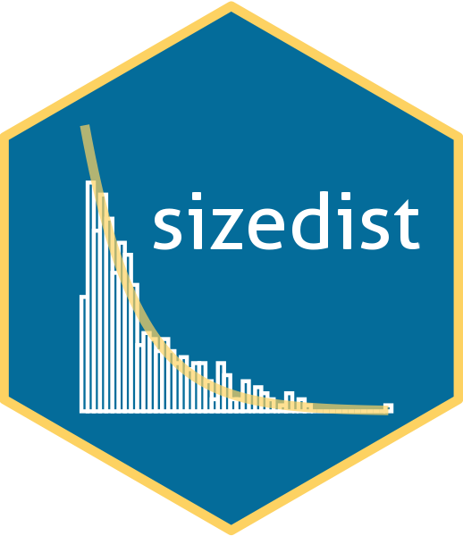

<!-- README.md is generated from README.Rmd. Please edit that file -->

```{r, include = FALSE}
knitr::opts_chunk$set(
  collapse = TRUE,
   eval = FALSE,
  comment = "#>",
  fig.path = "man/figures/README-",
  out.width = "100%"
)
```

# sizedist 

<!-- badges: start -->
[](https://github.com/traitecoevo/sizedist/actions)
[](https://codecov.io/gh/traitecoevo/sizedist?branch=master)
<!-- badges: end -->

`sizedist` allow users to estimate growth and mortality in populations as continuous functions using the theory of size-structured populations. Read more about how `sizedist` is implemented in: 
Hinchliffe, C., Pepin, P., Suthers, I. M., & Falster, D. S. (2021). [A novel approach for estimating growth and mortality of fish larvae](https://academic.oup.com/icesjms/advance-article/doi/10.1093/icesjms/fsab161/6364353?login=true) *ICES Journal of Marine Science*.

## Installation

`sizedist` is still currently under *active* development. You can install the current version of `sizedist` using:

```{r, install}
# install.packages("remotes")
remotes::install_github("traitecoevo/sizedist", ref = "develop", build_vignettes = TRUE)
```

We recommend users to take a look at the "Getting Started" vignette for a brief introduction on some of the functions in `sizedist`

```{r vignette}
browseVignettes("sizedist")
```
