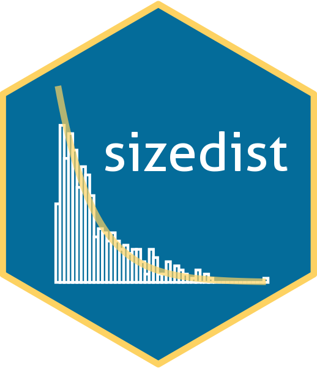

<!-- README.md is generated from README.Rmd. Please edit that file -->

# sizedist 

<!-- badges: start -->
<!-- badges: end -->

`sizedist` allow users to estimate growth and mortality in populations
as continuous functions using the theory of size-structured populations.
Read more about how `sizedist` is implemented in: Hinchliffe, C., Pepin,
P., Suthers, I. M., & Falster, D. S. (2021). [A novel approach for
estimating growth and mortality of fish
larvae](https://academic.oup.com/icesjms/advance-article/doi/10.1093/icesjms/fsab161/6364353?login=true)
*ICES Journal of Marine Science*.

## Installation

`sizedist` is still currently under *active* development. You can
install the current version of `sizedist` using:

``` r
# install.packages("remotes")
remotes::install.packages("sizedist", ref = "develop")
```

We recommend users to take a look at the “Getting Started” vignette for
a brief introduction on some of the functions in `sizedist`

``` r
browseVignettes("sizedist")
```
