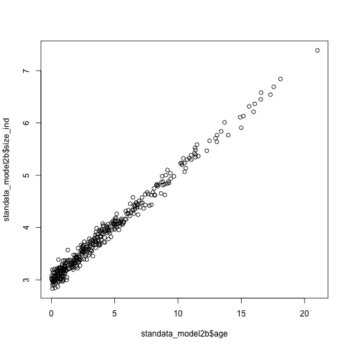

`sizedist`  is an R interface for Stan and provides functions to simulate and fit size and age-structured populations models to data. In this *Getting Started* vignette, we will cover the simplest model that is implemented in the package. `model1` assumes mortality and growth are constants. See the Theory vignette for more details on the various models in `sizedist`

### Simulating age- and size- structured data

To begin, let's first start by simulating some data of a hypothetical population. We first need to set some **-parameters** that are used to inform the simulation. See the XXX vignette on the definitions for each parameter. `sizedist` has default parameters that you can access using the `default_pars()` function. Note that these parameters are organised as a **list** object and will also be used during model fitting. Learn more about [lists](https://www.tutorialspoint.com/r/r_lists.html)


```r
library(sizedist)

#Calling this function will return a list of parameters
#Tip: Assign this function into an object for later use
pars <- default_pars("model1")

pars
#> $model
#> [1] "model1"
#> 
#> $pars
#> $pars$R
#> [1] 100
#> 
#> $pars$s0_av
#> [1] 3
#> 
#> $pars$log10s0_sd
#> [1] 0
#> 
#> $pars$g_av
#> [1] 0.21
#> 
#> $pars$log10g_sd
#> [1] 0
#> 
#> $pars$z_av
#> [1] 0.25
#> 
#> $pars$log10z_sd
#> [1] 0
```

We can now use these parameters to simulate some data using the `simulate_population()` function.


```r
#Tip: Assign this function to an object so you have access to the data
data <- simulate_population(pars)

data
#> # A tibble: 387 × 10
#>    time_birth time_end   age size_birth growth_rate mortality_rate  size
#>         <dbl>    <dbl> <dbl>      <dbl>       <dbl>          <dbl> <dbl>
#>  1       2.00       25  23.0          3        0.21           0.25  7.83
#>  2       3.88       25  21.1          3        0.21           0.25  7.44
#>  3       5.55       25  19.5          3        0.21           0.25  7.09
#>  4       5.70       25  19.3          3        0.21           0.25  7.05
#>  5       7.52       25  17.5          3        0.21           0.25  6.67
#>  6       7.75       25  17.3          3        0.21           0.25  6.62
#>  7       8.11       25  16.9          3        0.21           0.25  6.55
#>  8       8.38       25  16.6          3        0.21           0.25  6.49
#>  9       8.72       25  16.3          3        0.21           0.25  6.42
#> 10       8.94       25  16.1          3        0.21           0.25  6.37
#> # ℹ 377 more rows
#> # ℹ 3 more variables: cumulative_hazard <dbl>, survival <dbl>, is_dead <lgl>
```

We created two plotting functions to visualise the distribution of size and age of the simulated population


```r
plot_age_dist(data, pars, binwidth = 1)
```

<div class="figure" style="text-align: center">

<p class="caption">plot of chunk visualise</p>
</div>

### Creating binned data for size

In order to estimate a distribution for size/age in our models, we need  to create bins or 'class intervals' for these variables and tally up the number of observations that fall into each of these bins. The `summarise_bin_counts()` function will do the trick!


```r
# Compute bins for age
age_data <- data %>% summarise_bin_counts(bin_var = age,
                                          bin_width = 1)

age_data
#> # A tibble: 24 × 4
#>    binned_var bin_lower bin_upper counts
#>         <dbl>     <dbl>     <dbl>  <int>
#>  1          0       0         0.5     48
#>  2          1       0.5       1.5     74
#>  3          2       1.5       2.5     65
#>  4          3       2.5       3.5     43
#>  5          4       3.5       4.5     28
#>  6          5       4.5       5.5     24
#>  7          6       5.5       6.5     26
#>  8          7       6.5       7.5     22
#>  9          8       7.5       8.5     10
#> 10          9       8.5       9.5     10
#> # ℹ 14 more rows
```

### Compose data for model fitting

`sizedist` relies on Stan for estimating size/age distribution models. Stan requires our input data to be a specific list format. Conveniently, the `compose_count_data()` function will translate your binned data into a list for you. Each column from your bin data is converted into a list element with the same name. Learn more about [lists](https://www.tutorialspoint.com/r/r_lists.html)


```r
standata_age <- age_data %>% compose_count_data()

str(standata_age) # Ta da! Your binned data is now a list!
#> List of 5
#>  $ binned_var: num [1:24(1d)] 0 1 2 3 4 5 6 7 8 9 ...
#>  $ bin_lower : num [1:24(1d)] 0 0.5 1.5 2.5 3.5 4.5 5.5 6.5 7.5 8.5 ...
#>  $ bin_upper : num [1:24(1d)] 0.5 1.5 2.5 3.5 4.5 5.5 6.5 7.5 8.5 9.5 ...
#>  $ counts    : int [1:24(1d)] 48 74 65 43 28 24 26 22 10 10 ...
#>  $ N_counts  : int 24
```

### Fitting your model

`sizedist` currently suports three types of models. We will fit `model1a` which assumes that mortality and growth are constant over time. All models can be viewed using this XXX function. A more detailed overview of each of these models are found in the **Theory vignette**. Before we fit our first model, we need to add some parameters into our data list. Any relevant parameters such as the name of the model is added automatically using the `add_pars()` function.

### Model 1: Constant growth with size

`sizedist` currently supports two types of general models (`model` and `model2`) each with several variants (`model1a`, `model1b`, `model1c`,`model1d`, `model1e`, `model2a`, `model2e`). Variants of models with the prefix `model1_` (or `model2_`) all share a common growth function. `model1_` assumes **constant** mortality and growth. `model2_` assumes growth follows a **power** function with size (Refer to the 'Theory' vignette for more details).

In order to fit these different variants of models, you will need to specify the name using the `list_modify()` from the `purrr` package,


```r
# install.packages("purrr")

(model1a_pars <- pars %>% purrr::list_modify(model = "model1a"))
#> $model
#> [1] "model1a"
#> 
#> $pars
#> $pars$R
#> [1] 100
#> 
#> $pars$s0_av
#> [1] 3
#> 
#> $pars$log10s0_sd
#> [1] 0
#> 
#> $pars$g_av
#> [1] 0.21
#> 
#> $pars$log10g_sd
#> [1] 0
#> 
#> $pars$z_av
#> [1] 0.25
#> 
#> $pars$log10z_sd
#> [1] 0
```

#### Priors in sizedist models

The default priors used for all sizedist models are XXX (uninformative? uniform?). We can add default priors for our model, by calling the `default_priors()` function. This function will join the priors in your pars list. Note that set of priors available depends on the model specified in `pars$model`.


```r
(model1a_pars <- model1a_pars %>% default_priors())
#> $model
#> [1] "model1a"
#> 
#> $pars
#> $pars$R
#> [1] 100
#> 
#> $pars$s0_av
#> [1] 3
#> 
#> $pars$log10s0_sd
#> [1] 0
#> 
#> $pars$g_av
#> [1] 0.21
#> 
#> $pars$log10g_sd
#> [1] 0
#> 
#> $pars$z_av
#> [1] 0.25
#> 
#> $pars$log10z_sd
#> [1] 0
#> 
#> 
#> $priors
#> $priors$Z_mu
#> [1] 0.1
#> 
#> $priors$Z_sd
#> [1] 1
#> 
#> $priors$R_mu
#> [1] 100
#> 
#> $priors$R_sd
#> [1] 10
```

Use the `list_modify()` function if you would like to set your own prior values. Note that the priors are nested within a the main list of `pars` so you will need to use the syntax below to update those numbers.


```r
(model1a_pars <- model1a_pars %>% purrr::list_modify(priors = list(Z_sd = 15)))
#> $model
#> [1] "model1a"
#> 
#> $pars
#> $pars$R
#> [1] 100
#> 
#> $pars$s0_av
#> [1] 3
#> 
#> $pars$log10s0_sd
#> [1] 0
#> 
#> $pars$g_av
#> [1] 0.21
#> 
#> $pars$log10g_sd
#> [1] 0
#> 
#> $pars$z_av
#> [1] 0.25
#> 
#> $pars$log10z_sd
#> [1] 0
#> 
#> 
#> $priors
#> $priors$Z_mu
#> [1] 0.1
#> 
#> $priors$Z_sd
#> [1] 15
#> 
#> $priors$R_mu
#> [1] 100
#> 
#> $priors$R_sd
#> [1] 10
```

Once the `pars` pbject has been updated, it  will need to be joined to the data list created above. Note that `add_pars()` will by default, prune the `pars` list to the parameters that are only used in model fitting.

```r
standata_model1a <- standata_age %>% add_pars(pars = model1a_pars)

str(standata_model1a) #Model name is added to the end of the data list
#> List of 7
#>  $ binned_var: num [1:24(1d)] 0 1 2 3 4 5 6 7 8 9 ...
#>  $ bin_lower : num [1:24(1d)] 0 0.5 1.5 2.5 3.5 4.5 5.5 6.5 7.5 8.5 ...
#>  $ bin_upper : num [1:24(1d)] 0.5 1.5 2.5 3.5 4.5 5.5 6.5 7.5 8.5 9.5 ...
#>  $ counts    : int [1:24(1d)] 48 74 65 43 28 24 26 22 10 10 ...
#>  $ N_counts  : int 24
#>  $ model     : chr "model1a"
#>  $ priors    :List of 4
#>   ..$ Z_mu: num 0.1
#>   ..$ Z_sd: num 15
#>   ..$ R_mu: num 100
#>   ..$ R_sd: num 10
```

#### 1a: Estimating mortality from age

Use run the model with the `fit_sizedist()` function


```r
model1a_fit <- fit_sizedist(standata_model1a)

print(model1a_fit, probs=c(0.025, 0.5, 0.975))
```

then you can extract the fitted values for Z and R and plot that against the data


```r
model1a_fitted <- extract_fitted(model1a_fit, model1a_pars)

plot_age_dist(data, pars, binwidth = 1, model1a_fitted)
```

<div class="figure" style="text-align: center">

<p class="caption">plot of chunk unnamed-chunk-5</p>
</div>

#### 1b: Mortality from size, with known growth model

In some instances, a known growth rate found in the literature or other studies can be used to inform the model that is estimating the size distribution. In this example, we will use the simulated size data.


```r
plot_size_dist(data, pars, binwidth = 0.1)
```

<div class="figure" style="text-align: center">

<p class="caption">plot of chunk unnamed-chunk-6</p>
</div>


```r
# Compute bins for size
size_data <- data %>% summarise_bin_counts(bin_var = size,
                                          bin_width = 0.1)
# Compose data
standata_size <- size_data %>% compose_count_data()
```

In order to fit the *Constant Mortality, known Growth model* (`model1b`), we will need to edit the model name using `list_modify()`. Similarly, you can edit the values  for `g_av` which represents the average growth rate and `s0_av` which represents the average size at hatching/birth within the same function. Note that the parameters `g_av ` and `s0_av` are within a nested list of `pars` so you will need to use some special syntax to update those numbers.


```r
# Assign default parameters into an object
pars  <- default_pars("model1")

pars_model1b <- purrr::list_modify(pars,
                                  model = "model1b",
                                  pars = list(g_av = 0.21))
```

Now lets add our default priors again


```r
pars_model1b <- pars_model1b %>% default_priors()
```

Similar to the first example, we will know need to add our `pars` list to our data list in order to run our model with `add_pars()`.


```r
standata_model1b <- standata_size %>% add_pars(pars_model1b)

str(standata_model1b)
#> List of 8
#>  $ binned_var: num [1:49(1d)] 3 3.1 3.2 3.3 3.4 3.5 3.6 3.7 3.8 3.9 ...
#>  $ bin_lower : num [1:49(1d)] 3 3.05 3.15 3.25 3.35 3.45 3.55 3.65 3.75 3.85 ...
#>  $ bin_upper : num [1:49(1d)] 3.05 3.15 3.25 3.35 3.45 3.55 3.65 3.75 3.85 3.95 ...
#>  $ counts    : int [1:49(1d)] 24 44 36 31 30 27 24 18 14 11 ...
#>  $ N_counts  : int 49
#>  $ model     : chr "model1b"
#>  $ priors    :List of 4
#>   ..$ Z_mu: num 0.1
#>   ..$ Z_sd: num 1
#>   ..$ R_mu: num 100
#>   ..$ R_sd: num 10
#>  $ pars      :List of 2
#>   ..$ s0_av: num 3
#>   ..$ g_av : num 0.21
```

Again, lets fit the model


```r
model1b_fit <- fit_sizedist(standata_model1b)

print(model1b_fit, probs=c(0.025, 0.5, 0.975))
```

and plot the fitted values onto the data


```r

model1b_fitted <- extract_fitted(model1b_fit, pars_model1b)

plot_size_dist(data, pars, binwidth = 0.1, model1b_fitted)
```

<div class="figure" style="text-align: center">

<p class="caption">plot of chunk unnamed-chunk-11</p>
</div>

#### 1c: Estimating Growth and Mortality

The next model that `sizedist` currently supports (`model1c`) can estimate mortality and growth simultaneously using size and age data. In our simulated dataset, we have information on individual's sizes at particular ages as well as the overall distribution of sizes across the population. These data were simulated with no sampling error.


```r
library(ggplot2)

ggplot(data, aes(size, age)) +
  geom_point()
```

<div class="figure" style="text-align: center">

<p class="caption">plot of chunk unnamed-chunk-12</p>
</div>

We need to first add some sampling noise to the size observations before we can fit the model using the `add_sampling_noise()` function. Otherwise, the model will have a hard time running! This step is not needed if you are using your own data! See XXX case study.


```r
growth_data <- simulate_population(default_pars("model1")) %>%
  add_sampling_noise(size, sd = 0.5)

ggplot(growth_data, aes(age, size)) +
  geom_point()
```

<div class="figure" style="text-align: center">

<p class="caption">plot of chunk unnamed-chunk-13</p>
</div>

Then we can put the growth data in the correct Stan friendly format using `compose_growth_data()`.


```r
# Counts data
standata_size <- size_data %>%
  compose_count_data()

# Growth data
standata_growth <-
  growth_data %>%
  compose_growth_data(age_var = age,
                      size_var = size)

str(standata_growth)
#> List of 3
#>  $ age     : num [1:380(1d)] 21 18.1 17.6 17.3 16.6 ...
#>  $ size_ind: num [1:380(1d)] 7.39 6.84 6.69 6.54 6.58 ...
#>  $ N_growth: int 380
```

Now we will bring these data together using `join_stan_data()`


```r
# Combining the two types of data lists together
standata_model1c <- join_stan_data(standata_size, standata_growth)

str(standata_model1c)
#> List of 8
#>  $ binned_var: num [1:49(1d)] 3 3.1 3.2 3.3 3.4 3.5 3.6 3.7 3.8 3.9 ...
#>  $ bin_lower : num [1:49(1d)] 3 3.05 3.15 3.25 3.35 3.45 3.55 3.65 3.75 3.85 ...
#>  $ bin_upper : num [1:49(1d)] 3.05 3.15 3.25 3.35 3.45 3.55 3.65 3.75 3.85 3.95 ...
#>  $ counts    : int [1:49(1d)] 24 44 36 31 30 27 24 18 14 11 ...
#>  $ N_counts  : int 49
#>  $ age       : num [1:380(1d)] 21 18.1 17.6 17.3 16.6 ...
#>  $ size_ind  : num [1:380(1d)] 7.39 6.84 6.69 6.54 6.58 ...
#>  $ N_growth  : int 380
```

To fit this model (`model1c`), we will again need to update our parameters if desired, add our priors and then and join them to our combined data list before fitting. Again, you can supply your own value for `s0_av` which represents the average size at hatching/birth using `list_modify()`


```r
pars  <- default_pars("model1")

pars_model1c <- purrr::list_modify(pars,
                        model = "model1c")

# Add in default priors
pars_model1c <- pars_model1c %>% default_priors()

# Add in parameters to data list
standata_model1c <- standata_model1c %>% add_pars(pars_model1c)
str(standata_model1c)
#> List of 11
#>  $ binned_var: num [1:49(1d)] 3 3.1 3.2 3.3 3.4 3.5 3.6 3.7 3.8 3.9 ...
#>  $ bin_lower : num [1:49(1d)] 3 3.05 3.15 3.25 3.35 3.45 3.55 3.65 3.75 3.85 ...
#>  $ bin_upper : num [1:49(1d)] 3.05 3.15 3.25 3.35 3.45 3.55 3.65 3.75 3.85 3.95 ...
#>  $ counts    : int [1:49(1d)] 24 44 36 31 30 27 24 18 14 11 ...
#>  $ N_counts  : int 49
#>  $ age       : num [1:380(1d)] 21 18.1 17.6 17.3 16.6 ...
#>  $ size_ind  : num [1:380(1d)] 7.39 6.84 6.69 6.54 6.58 ...
#>  $ N_growth  : int 380
#>  $ model     : chr "model1c"
#>  $ priors    :List of 7
#>   ..$ Z_mu         : num 0.1
#>   ..$ Z_sd         : num 1
#>   ..$ g_mu         : num 0.1
#>   ..$ g_sd         : num 1
#>   ..$ R_mu         : num 100
#>   ..$ R_sd         : num 10
#>   ..$ sigma_size_sd: num 2.5
#>  $ pars      :List of 1
#>   ..$ s0_av: num 3
```

Fit model1c


```r
model1c_fit <- fit_sizedist(standata_model1c)

print(model1c_fit, probs=c(0.025, 0.5, 0.975))
```

and plot the fitted values onto the data


```r

model1c_fitted <- extract_fitted(model1c_fit, pars_model1c)

plot_size_dist(data, pars, binwidth = 0.1, model1c_fitted)
```

<div class="figure" style="text-align: center">

<p class="caption">plot of chunk unnamed-chunk-18</p>
</div>

#### 1d: Estimating Growth, Mortality and size-at-hatch.

There is a version of model1 (`model1d`) which also estimates size-at-hatch `s0` from the size-at-age and size data using a similar method to `model1c`.


```r
pars  <- default_pars("model1")

pars_model1d <- purrr::list_modify(pars,
                        model = "model1d")

# Add in default priors
pars_model1d <- pars_model1d %>% default_priors()

# Recreat sizedata
standata_model1d <- join_stan_data(standata_size, standata_growth)

str(standata_model1d)

# Add in parameters to data list
standata_model1d <- standata_model1d %>% add_pars(pars_model1d)

str(standata_model1d)
#> List of 8
#>  $ binned_var: num [1:49(1d)] 3 3.1 3.2 3.3 3.4 3.5 3.6 3.7 3.8 3.9 ...
#>  $ bin_lower : num [1:49(1d)] 3 3.05 3.15 3.25 3.35 3.45 3.55 3.65 3.75 3.85 ...
#>  $ bin_upper : num [1:49(1d)] 3.05 3.15 3.25 3.35 3.45 3.55 3.65 3.75 3.85 3.95 ...
#>  $ counts    : int [1:49(1d)] 24 44 36 31 30 27 24 18 14 11 ...
#>  $ N_counts  : int 49
#>  $ age       : num [1:380(1d)] 21 18.1 17.6 17.3 16.6 ...
#>  $ size_ind  : num [1:380(1d)] 7.39 6.84 6.69 6.54 6.58 ...
#>  $ N_growth  : int 380
#> List of 10
#>  $ binned_var: num [1:49(1d)] 3 3.1 3.2 3.3 3.4 3.5 3.6 3.7 3.8 3.9 ...
#>  $ bin_lower : num [1:49(1d)] 3 3.05 3.15 3.25 3.35 3.45 3.55 3.65 3.75 3.85 ...
#>  $ bin_upper : num [1:49(1d)] 3.05 3.15 3.25 3.35 3.45 3.55 3.65 3.75 3.85 3.95 ...
#>  $ counts    : int [1:49(1d)] 24 44 36 31 30 27 24 18 14 11 ...
#>  $ N_counts  : int 49
#>  $ age       : num [1:380(1d)] 21 18.1 17.6 17.3 16.6 ...
#>  $ size_ind  : num [1:380(1d)] 7.39 6.84 6.69 6.54 6.58 ...
#>  $ N_growth  : int 380
#>  $ model     : chr "model1d"
#>  $ priors    :List of 9
#>   ..$ Z_mu         : num 0.1
#>   ..$ Z_sd         : num 1
#>   ..$ g_mu         : num 0.1
#>   ..$ g_sd         : num 1
#>   ..$ R_mu         : num 100
#>   ..$ R_sd         : num 10
#>   ..$ s0_mu        : num 3
#>   ..$ s0_sd        : num 0.1
#>   ..$ sigma_size_sd: num 2.5
```

Fit model1d


```r
model1d_fit <- fit_sizedist(standata_model1d)

print(model1d_fit, probs=c(0.025, 0.5, 0.975))
#> 
#> SAMPLING FOR MODEL 'model1d' NOW (CHAIN 1).
#> Chain 1: 
#> Chain 1: Gradient evaluation took 3.1e-05 seconds
#> Chain 1: 1000 transitions using 10 leapfrog steps per transition would take 0.31 seconds.
#> Chain 1: Adjust your expectations accordingly!
#> Chain 1: 
#> Chain 1: 
#> Chain 1: Iteration:    1 / 2000 [  0%]  (Warmup)
#> Chain 1: Iteration:  200 / 2000 [ 10%]  (Warmup)
#> Chain 1: Iteration:  400 / 2000 [ 20%]  (Warmup)
#> Chain 1: Iteration:  600 / 2000 [ 30%]  (Warmup)
#> Chain 1: Iteration:  800 / 2000 [ 40%]  (Warmup)
#> Chain 1: Iteration: 1000 / 2000 [ 50%]  (Warmup)
#> Chain 1: Iteration: 1001 / 2000 [ 50%]  (Sampling)
#> Chain 1: Iteration: 1200 / 2000 [ 60%]  (Sampling)
#> Chain 1: Iteration: 1400 / 2000 [ 70%]  (Sampling)
#> Chain 1: Iteration: 1600 / 2000 [ 80%]  (Sampling)
#> Chain 1: Iteration: 1800 / 2000 [ 90%]  (Sampling)
#> Chain 1: Iteration: 2000 / 2000 [100%]  (Sampling)
#> Chain 1: 
#> Chain 1:  Elapsed Time: 0.238484 seconds (Warm-up)
#> Chain 1:                0.145254 seconds (Sampling)
#> Chain 1:                0.383738 seconds (Total)
#> Chain 1: 
#> 
#> SAMPLING FOR MODEL 'model1d' NOW (CHAIN 2).
#> Chain 2: 
#> Chain 2: Gradient evaluation took 2.1e-05 seconds
#> Chain 2: 1000 transitions using 10 leapfrog steps per transition would take 0.21 seconds.
#> Chain 2: Adjust your expectations accordingly!
#> Chain 2: 
#> Chain 2: 
#> Chain 2: Iteration:    1 / 2000 [  0%]  (Warmup)
#> Chain 2: Iteration:  200 / 2000 [ 10%]  (Warmup)
#> Chain 2: Iteration:  400 / 2000 [ 20%]  (Warmup)
#> Chain 2: Iteration:  600 / 2000 [ 30%]  (Warmup)
#> Chain 2: Iteration:  800 / 2000 [ 40%]  (Warmup)
#> Chain 2: Iteration: 1000 / 2000 [ 50%]  (Warmup)
#> Chain 2: Iteration: 1001 / 2000 [ 50%]  (Sampling)
#> Chain 2: Iteration: 1200 / 2000 [ 60%]  (Sampling)
#> Chain 2: Iteration: 1400 / 2000 [ 70%]  (Sampling)
#> Chain 2: Iteration: 1600 / 2000 [ 80%]  (Sampling)
#> Chain 2: Iteration: 1800 / 2000 [ 90%]  (Sampling)
#> Chain 2: Iteration: 2000 / 2000 [100%]  (Sampling)
#> Chain 2: 
#> Chain 2:  Elapsed Time: 0.269184 seconds (Warm-up)
#> Chain 2:                0.166173 seconds (Sampling)
#> Chain 2:                0.435357 seconds (Total)
#> Chain 2: 
#> 
#> SAMPLING FOR MODEL 'model1d' NOW (CHAIN 3).
#> Chain 3: 
#> Chain 3: Gradient evaluation took 1.6e-05 seconds
#> Chain 3: 1000 transitions using 10 leapfrog steps per transition would take 0.16 seconds.
#> Chain 3: Adjust your expectations accordingly!
#> Chain 3: 
#> Chain 3: 
#> Chain 3: Iteration:    1 / 2000 [  0%]  (Warmup)
#> Chain 3: Iteration:  200 / 2000 [ 10%]  (Warmup)
#> Chain 3: Iteration:  400 / 2000 [ 20%]  (Warmup)
#> Chain 3: Iteration:  600 / 2000 [ 30%]  (Warmup)
#> Chain 3: Iteration:  800 / 2000 [ 40%]  (Warmup)
#> Chain 3: Iteration: 1000 / 2000 [ 50%]  (Warmup)
#> Chain 3: Iteration: 1001 / 2000 [ 50%]  (Sampling)
#> Chain 3: Iteration: 1200 / 2000 [ 60%]  (Sampling)
#> Chain 3: Iteration: 1400 / 2000 [ 70%]  (Sampling)
#> Chain 3: Iteration: 1600 / 2000 [ 80%]  (Sampling)
#> Chain 3: Iteration: 1800 / 2000 [ 90%]  (Sampling)
#> Chain 3: Iteration: 2000 / 2000 [100%]  (Sampling)
#> Chain 3: 
#> Chain 3:  Elapsed Time: 0.253439 seconds (Warm-up)
#> Chain 3:                0.168688 seconds (Sampling)
#> Chain 3:                0.422127 seconds (Total)
#> Chain 3: 
#> 
#> SAMPLING FOR MODEL 'model1d' NOW (CHAIN 4).
#> Chain 4: 
#> Chain 4: Gradient evaluation took 1.9e-05 seconds
#> Chain 4: 1000 transitions using 10 leapfrog steps per transition would take 0.19 seconds.
#> Chain 4: Adjust your expectations accordingly!
#> Chain 4: 
#> Chain 4: 
#> Chain 4: Iteration:    1 / 2000 [  0%]  (Warmup)
#> Chain 4: Iteration:  200 / 2000 [ 10%]  (Warmup)
#> Chain 4: Iteration:  400 / 2000 [ 20%]  (Warmup)
#> Chain 4: Iteration:  600 / 2000 [ 30%]  (Warmup)
#> Chain 4: Iteration:  800 / 2000 [ 40%]  (Warmup)
#> Chain 4: Iteration: 1000 / 2000 [ 50%]  (Warmup)
#> Chain 4: Iteration: 1001 / 2000 [ 50%]  (Sampling)
#> Chain 4: Iteration: 1200 / 2000 [ 60%]  (Sampling)
#> Chain 4: Iteration: 1400 / 2000 [ 70%]  (Sampling)
#> Chain 4: Iteration: 1600 / 2000 [ 80%]  (Sampling)
#> Chain 4: Iteration: 1800 / 2000 [ 90%]  (Sampling)
#> Chain 4: Iteration: 2000 / 2000 [100%]  (Sampling)
#> Chain 4: 
#> Chain 4:  Elapsed Time: 0.253827 seconds (Warm-up)
#> Chain 4:                0.186283 seconds (Sampling)
#> Chain 4:                0.44011 seconds (Total)
#> Chain 4: 
#> Inference for Stan model: model1d.
#> 4 chains, each with iter=2000; warmup=1000; thin=1; 
#> post-warmup draws per chain=1000, total post-warmup draws=4000.
#> 
#>               mean se_mean   sd    2.5%     50%   97.5% n_eff Rhat
#> Z             0.25    0.00 0.01    0.23    0.25    0.27  2335    1
#> R            98.19    0.13 5.94   86.51   98.20  110.22  2234    1
#> g             0.21    0.00 0.00    0.21    0.21    0.21  2725    1
#> s0            2.99    0.00 0.01    2.98    2.99    3.00  2990    1
#> sigma_size    0.10    0.00 0.00    0.09    0.10    0.11  3300    1
#> lp__       1385.09    0.04 1.63 1381.06 1385.40 1387.23  1748    1
#> 
#> Samples were drawn using NUTS(diag_e) at Wed Nov 29 13:37:58 2023.
#> For each parameter, n_eff is a crude measure of effective sample size,
#> and Rhat is the potential scale reduction factor on split chains (at 
#> convergence, Rhat=1).
```

and plot the fitted values onto the data


```r

model1d_fitted <- extract_fitted(model1d_fit, pars_model1d)

plot_size_dist(data, pars, binwidth = 0.1, model1d_fitted)
```

<div class="figure" style="text-align: center">

<p class="caption">plot of chunk unnamed-chunk-21</p>
</div>

#### 1e: Estimating Slope of abundance spectra.

The final version of model1 (`model1e`) which fits an abundance spectra model (change in abundance as a function of size) assuming constant growth, without estimating either mortality or growth individually.


```r
# Compute bins for size
size_data <- data %>% summarise_bin_counts(bin_var = size,
                                          bin_width = 0.1)
# Compose data
standata_size <- size_data %>% compose_count_data()
```

Add priors

```r
pars  <- default_pars("model1")

pars_model1e <- purrr::list_modify(pars,
                        model = "model1e")

# Add in default priors
pars_model1e <- pars_model1e %>% default_priors()

# Add in parameters to data list
standata_model1e <- standata_size %>% add_pars(pars_model1e)
#> Error in `add_pars()`:
#> ! Priors must be added before using add_pars! - Try default_priors()

standata_model1e
#> $binned_var
#>  [1] 3.0 3.1 3.2 3.3 3.4 3.5 3.6 3.7 3.8 3.9 4.0 4.1 4.2 4.3 4.4 4.5 4.6 4.7 4.8
#> [20] 4.9 5.0 5.1 5.2 5.3 5.4 5.5 5.6 5.7 5.8 5.9 6.0 6.1 6.2 6.3 6.4 6.5 6.6 6.7
#> [39] 6.8 6.9 7.0 7.1 7.2 7.3 7.4 7.5 7.6 7.7 7.8 7.9 8.0 8.1 8.2
#> 
#> $bin_lower
#>  [1] 3.00 3.05 3.15 3.25 3.35 3.45 3.55 3.65 3.75 3.85 3.95 4.05 4.15 4.25 4.35
#> [16] 4.45 4.55 4.65 4.75 4.85 4.95 5.05 5.15 5.25 5.35 5.45 5.55 5.65 5.75 5.85
#> [31] 5.95 6.05 6.15 6.25 6.35 6.45 6.55 6.65 6.75 6.85 6.95 7.05 7.15 7.25 7.35
#> [46] 7.45 7.55 7.65 7.75 7.85 7.95 8.05 8.20
#> 
#> $bin_upper
#>  [1] 3.05 3.15 3.25 3.35 3.45 3.55 3.65 3.75 3.85 3.95 4.05 4.15 4.25 4.35 4.45
#> [16] 4.55 4.65 4.75 4.85 4.95 5.05 5.15 5.25 5.35 5.45 5.55 5.65 5.75 5.85 5.95
#> [31] 6.05 6.15 6.25 6.35 6.45 6.55 6.65 6.75 6.85 6.95 7.05 7.15 7.25 7.35 7.45
#> [46] 7.55 7.65 7.75 7.85 7.95 8.05 8.15 8.25
#> 
#> $counts
#>  [1] 127 208 194 166 140 129 105 106  84  82  81  46  60  55  53  31  24  28  31
#> [20]  26  19  18  13  11  11   8  11   9   5   9  10   8   7   2   7   3   3   2
#> [39]   2   1   2   5   1   2   1   2   0   1   2   0   2   0   1
#> 
#> $N_counts
#> [1] 53
#> 
#> $model
#> [1] "model1e"
#> 
#> $priors
#> $priors$c_mu
#> [1] 5
#> 
#> $priors$c_sd
#> [1] 1
#> 
#> $priors$b_mu
#> [1] 0.5
#> 
#> $priors$b_sd
#> [1] 1
```

Fit model1e


```r
model1e_fit <- fit_sizedist(standata_model1e)

print(model1e_fit, probs=c(0.025, 0.5, 0.975))
#> NULL
```

### Model fit diagnostics

Once the models have been fit, we can extract posteriors and run diagnostics to assess model fitting. Here, we focus on output from the model estimating growth and mortality simultaneously  (`model1c`), but the process is the same for each of the three models. Further methods, examples and discussion of MCMC diagnostics is provided by Gabry and Modrák (2021) in <https://mc-stan.org/bayesplot/articles/visual-mcmc-diagnostics.html>

We recommend are several CRAN packages that are wonderful for interacting with Stan model fit objects and visualising model diagnostics


```r
library(ggplot2)
library(rstan)
library(bayesplot)
library(patchwork)
```

#### Model convergence
First, we observe the mean estimate for each coefficient. Note the Gelman–Rubin statistic (Rhat) to assess convergence. Is it > or = 1?


```r
print(model1d_fit, probs=c(0.025, 0.5, 0.975))
```

Next, we can plot the trace chains to see if they converged or not. Are some chains getting stuck? What you want to see here is all four chains to eventually overlap each other across most of the iterations

```r
p_trace <- rstan::traceplot(model1d_fit, pars = c("Z", "g", "R", "s0"),
                            inc_warmup = TRUE) +
  xlab("Iteration") +
  ylab("Parameter estimate")

p_trace
```

<div class="figure" style="text-align: center">

<p class="caption">plot of chunk unnamed-chunk-27</p>
</div>

#### No-U-Turn-Sampler (NUTS) energy diagnostics

- The first histogram uses the function `mcmc_nuts_energy()`
Produces overlaid histograms showing energy__ πE (i.e., the value of the Hamiltonian (up to an additive constant) at each sample) vers the change in energy__ πΔE (See Betancourt (2016) for details.) In the figure, we want to *see if the histograms for πE and πΔE are approximately equal*. If the distribution of πΔE has deviated from πE (e.g., wider tails) then autocorrelation of the chains will be large. For more details check out this [paper](https://arxiv.org/abs/1604.00695).

- The remaining histograms uses the function`mcmc_scatter()`
This function produces bivariate scatterplots of the MCMC draws, with the divergent chains highlighted. Here we are checking to *see if the divergent chains are clustered in parameter space*. If the divergent chains are spread out, then they are most probably false positive results and can be discounted. If the divergences are clustered, it is indicative that sampling has not computed a reliable answer. More details on why the scatter plot with divergences is a useful diagnostic tool can be found in [Gabry et al. (2019)](https://rss.onlinelibrary.wiley.com/doi/full/10.1111/rssa.12378).


```r
color_scheme_set("red")
np <- nuts_params(model1d_fit)

nuts_1 <- mcmc_nuts_energy(np) + ggtitle("NUTS Energy Diagnostic")

color_scheme_set("darkgray")
nuts_2 <- mcmc_scatter(
  as.matrix(model1d_fit),
  pars = c("g", "Z"),
  np = nuts_params(model1d_fit),
  np_style = scatter_style_np(div_color = "green", div_alpha = 0.8)
)

nuts_3 <- mcmc_scatter(
  as.matrix(model1d_fit),
  pars = c("Z", "R"),
  np = nuts_params(model1d_fit),
  np_style = scatter_style_np(div_color = "green", div_alpha = 0.8)
)

nuts_4 <- mcmc_scatter(
  as.matrix(model1d_fit),
  pars = c("R", "g"),
  np = nuts_params(model1d_fit),
  np_style = scatter_style_np(div_color = "green", div_alpha = 0.8)
)

nuts_1 / (nuts_2 + nuts_3 + nuts_4)
```

<div class="figure" style="text-align: center">

<p class="caption">plot of chunk unnamed-chunk-28</p>
</div>

#### ShinyStan
A GUI is available for the diagnostic analysis and visualisation for MCMC from stan. Using ShinyStan allows for the exploration of stan output through your web browser. See <https://mc-stan.org/users/interfaces/shinystan>

```r
library(shinystan)

launch_shinystan(model1d_fit)
```

#### Distribution of posteriors of each parameter estimate

What are the things we should look out for?
- Sensibly behaved - biomodal or multimodel will need careful assessment - Expect unimodal unless a priori expectation?
- Are range of values on X axis expected?


```r
posterior <- as.matrix(model1d_fit)

plot_title <- ggtitle("Posterior distributions",
                      "with medians and 89% intervals")
post_1 <- mcmc_areas(posterior,
              pars = c("Z"),
              prob = 0.89) + plot_title

post_2 <-mcmc_areas(posterior,
           pars = c("g"),
           prob = 0.89) + plot_title

post_3 <- mcmc_areas(posterior,
           pars = c("R"),
           prob = 0.89) + plot_title

post_1 + post_2 + post_3
```

<div class="figure" style="text-align: center">

<p class="caption">plot of chunk unnamed-chunk-30</p>
</div>


#### Plot fitted estimates with data.

Then we can plot the fitted estimates to simulated data. First, we have to extract the fitted values using `extract_fitted()` and assigned it into a object. After, we can add this fitted object into `plot_size_dist()` so you can add a fitted line based on new model estimates to the previous size-frequency histogram.

How well does the fitted line match the data?


```r
# extract posterior mean estimates
fitted <- extract_fitted(model1d_fit, pars = pars_model1d)

pars <- default_pars("model1") %>%
  purrr::list_modify(model = "model1d")


# Plot fitted values on data
plot_size_dist(data, pars, binwidth = 0.1, fitted)
```

<div class="figure" style="text-align: center">

<p class="caption">plot of chunk unnamed-chunk-31</p>
</div>

We can also fit the growth model estimates to data, including posterior draws.

```r
# extract posterior draws
dat <- model1d_fit %>%
  rstan::extract() %>%
  as.data.frame() %>%
  as_tibble()

#plot
p <- ggplot(growth_data, aes(x= age, y = size)) +
  geom_point(size = 2, alpha = 0.8) +
  theme_bw() +
  xlab("Age") +
  ylab("Size")

dat2 <- dat %>% sample_n(100)

for(i in seq_len(nrow(dat2))) {
  p <- p + geom_abline(intercept = dat2$s0[i], slope = dat2$g[i], col = "blue", alpha = 0.1) #fit posterior draws
  }

p <- p +
  geom_abline(intercept = fitted$pars$s0, slope = fitted$pars$g_av, col = "red") #mean fit
p
```

<div class="figure" style="text-align: center">

<p class="caption">plot of chunk unnamed-chunk-32</p>
</div>


### Model 2: Growth as a power function of size

Model2 fits a size distribution assuming z and g vary as power functions of size, such that $z(s)=z ̅s^b$  and $g(s)=g ̅s^c$ where scaling components $b$ and $c$ are both = 1. For more details see the "Theory" vignette.

To fit variants of `model2`, the process is the same as fitting `model1` although we need to change the pars & priors to the appropriate model.


#### 2a: Slope of abundance spectrum

The `model2a` variant estimates the exponent $b$ and constant $c$ of an abundance spectrum $n(s)= cs^{-b}$

First select default pars for `model2` to simulate a test population

```r
pars <- default_pars("model2")

pars
#> NULL
```

We can now use these parameters to simulate some data using the `simulate_population()` function.


```r
data <- simulate_population(pars)
#> Error in switch(prefix, model1 = sample_individual_variation_model1(n, : EXPR must be a length 1 vector

data
#> # A tibble: 387 × 10
#>    time_birth time_end   age size_birth growth_rate mortality_rate  size
#>         <dbl>    <dbl> <dbl>      <dbl>       <dbl>          <dbl> <dbl>
#>  1       2.00       25  23.0          3        0.21           0.25  7.83
#>  2       3.88       25  21.1          3        0.21           0.25  7.44
#>  3       5.55       25  19.5          3        0.21           0.25  7.09
#>  4       5.70       25  19.3          3        0.21           0.25  7.05
#>  5       7.52       25  17.5          3        0.21           0.25  6.67
#>  6       7.75       25  17.3          3        0.21           0.25  6.62
#>  7       8.11       25  16.9          3        0.21           0.25  6.55
#>  8       8.38       25  16.6          3        0.21           0.25  6.49
#>  9       8.72       25  16.3          3        0.21           0.25  6.42
#> 10       8.94       25  16.1          3        0.21           0.25  6.37
#> # ℹ 377 more rows
#> # ℹ 3 more variables: cumulative_hazard <dbl>, survival <dbl>, is_dead <lgl>
```

Now compile data in counts per size bin

```r
# Compute bins for size
size_data <- data %>% summarise_bin_counts(bin_var = size,
                     bin_width = 0.01)
# Compose data
standata_size <- size_data %>% compose_count_data()
```

Add priors for `model2a`

```r
pars  <- default_pars("model2")

pars_model2a <- purrr::list_modify(pars,
                        model = "model2a")
#> Error in `purrr::list_modify()`:
#> ! `.x` must be a list, not NULL.

# Add in default priors
pars_model2a <- pars_model2a %>% default_priors()

# Add in parameters to data list
standata_model2a <- standata_size %>% add_pars(pars_model2a)

standata_model2a
#> $binned_var
#>   [1] 3.01 3.02 3.03 3.04 3.05 3.06 3.07 3.08 3.09 3.10 3.11 3.12 3.13 3.14 3.15
#>  [16] 3.16 3.17 3.18 3.19 3.20 3.21 3.22 3.23 3.24 3.25 3.26 3.27 3.28 3.29 3.30
#>  [31] 3.31 3.32 3.33 3.34 3.35 3.36 3.37 3.38 3.39 3.40 3.41 3.42 3.43 3.44 3.45
#>  [46] 3.46 3.47 3.48 3.49 3.50 3.51 3.52 3.53 3.54 3.55 3.56 3.57 3.58 3.59 3.60
#>  [61] 3.61 3.62 3.63 3.64 3.65 3.66 3.67 3.68 3.69 3.70 3.71 3.72 3.73 3.74 3.75
#>  [76] 3.76 3.77 3.78 3.79 3.80 3.81 3.82 3.83 3.84 3.85 3.86 3.87 3.88 3.89 3.90
#>  [91] 3.91 3.92 3.93 3.94 3.95 3.96 3.97 3.98 3.99 4.00 4.01 4.02 4.03 4.04 4.05
#> [106] 4.06 4.07 4.08 4.09 4.10 4.11 4.12 4.13 4.14 4.15 4.16 4.17 4.18 4.19 4.20
#> [121] 4.21 4.22 4.23 4.24 4.25 4.26 4.27 4.28 4.29 4.30 4.31 4.32 4.33 4.34 4.35
#> [136] 4.36 4.37 4.38 4.39 4.40 4.41 4.42 4.43 4.44 4.45 4.46 4.47 4.48 4.49 4.50
#> [151] 4.51 4.52 4.53 4.54 4.55 4.56 4.57 4.58 4.59 4.60 4.61 4.62 4.63 4.64 4.65
#> [166] 4.66 4.67 4.68 4.69 4.70 4.71 4.72 4.73 4.74 4.75 4.76 4.77 4.78 4.79 4.80
#> [181] 4.81 4.82 4.83 4.84 4.85 4.86 4.87 4.88 4.89 4.90 4.91 4.92 4.93 4.94 4.95
#> [196] 4.96 4.97 4.98 4.99 5.00 5.01 5.02 5.03 5.04 5.05 5.06 5.07 5.08 5.09 5.10
#> [211] 5.11 5.12 5.13 5.14 5.15 5.16 5.17 5.18 5.19 5.20 5.21 5.22 5.23 5.24 5.25
#> [226] 5.26 5.27 5.28 5.29 5.30 5.31 5.32 5.33 5.34 5.35 5.36 5.37 5.38 5.39 5.40
#> [241] 5.41 5.42 5.43 5.44 5.45 5.46 5.47 5.48 5.49 5.50 5.51 5.52 5.53 5.54 5.55
#> [256] 5.56 5.57 5.58 5.59 5.60 5.61 5.62 5.63 5.64 5.65 5.66 5.67 5.68 5.69 5.70
#> [271] 5.71 5.72 5.73 5.74 5.75 5.76 5.77 5.78 5.79 5.80 5.81 5.82 5.83 5.84 5.85
#> [286] 5.86 5.87 5.88 5.89 5.90 5.91 5.92 5.93 5.94 5.95 5.96 5.97 5.98 5.99 6.00
#> [301] 6.01 6.02 6.03 6.04 6.05 6.06 6.07 6.08 6.09 6.10 6.11 6.12 6.13 6.14 6.15
#> [316] 6.16 6.17 6.18 6.19 6.20 6.21 6.22 6.23 6.24 6.25 6.26 6.27 6.28 6.29 6.30
#> [331] 6.31 6.32 6.33 6.34 6.35 6.36 6.37 6.38 6.39 6.40 6.41 6.42 6.43 6.44 6.45
#> [346] 6.46 6.47 6.48 6.49 6.50 6.51 6.52 6.53 6.54 6.55 6.56 6.57 6.58 6.59 6.60
#> [361] 6.61 6.62 6.63 6.64 6.65 6.66 6.67 6.68 6.69 6.70 6.71 6.72 6.73 6.74 6.75
#> [376] 6.76 6.77 6.78 6.79 6.80 6.81 6.82 6.83 6.84 6.85 6.86 6.87 6.88 6.89 6.90
#> [391] 6.91 6.92 6.93 6.94 6.95 6.96 6.97 6.98 6.99 7.00 7.01 7.02 7.03 7.04 7.05
#> [406] 7.06 7.07 7.08 7.09 7.10 7.11 7.12 7.13 7.14 7.15 7.16 7.17 7.18 7.19 7.20
#> [421] 7.21 7.22 7.23 7.24 7.25 7.26 7.27 7.28 7.29 7.30 7.31 7.32 7.33 7.34 7.35
#> [436] 7.36 7.37 7.38 7.39 7.40 7.41 7.42 7.43 7.44 7.45 7.46 7.47 7.48 7.49 7.50
#> [451] 7.51 7.52 7.53 7.54 7.55 7.56 7.57 7.58 7.59 7.60 7.61 7.62 7.63 7.64 7.65
#> [466] 7.66 7.67 7.68 7.69 7.70 7.71 7.72 7.73 7.74 7.75 7.76 7.77 7.78 7.79 7.80
#> [481] 7.81 7.82 7.83
#> 
#> $bin_lower
#>   [1] 3.010 3.015 3.025 3.035 3.045 3.055 3.065 3.075 3.085 3.095 3.105 3.115 3.125
#>  [14] 3.135 3.145 3.155 3.165 3.175 3.185 3.195 3.205 3.215 3.225 3.235 3.245 3.255
#>  [27] 3.265 3.275 3.285 3.295 3.305 3.315 3.325 3.335 3.345 3.355 3.365 3.375 3.385
#>  [40] 3.395 3.405 3.415 3.425 3.435 3.445 3.455 3.465 3.475 3.485 3.495 3.505 3.515
#>  [53] 3.525 3.535 3.545 3.555 3.565 3.575 3.585 3.595 3.605 3.615 3.625 3.635 3.645
#>  [66] 3.655 3.665 3.675 3.685 3.695 3.705 3.715 3.725 3.735 3.745 3.755 3.765 3.775
#>  [79] 3.785 3.795 3.805 3.815 3.825 3.835 3.845 3.855 3.865 3.875 3.885 3.895 3.905
#>  [92] 3.915 3.925 3.935 3.945 3.955 3.965 3.975 3.985 3.995 4.005 4.015 4.025 4.035
#> [105] 4.045 4.055 4.065 4.075 4.085 4.095 4.105 4.115 4.125 4.135 4.145 4.155 4.165
#> [118] 4.175 4.185 4.195 4.205 4.215 4.225 4.235 4.245 4.255 4.265 4.275 4.285 4.295
#> [131] 4.305 4.315 4.325 4.335 4.345 4.355 4.365 4.375 4.385 4.395 4.405 4.415 4.425
#> [144] 4.435 4.445 4.455 4.465 4.475 4.485 4.495 4.505 4.515 4.525 4.535 4.545 4.555
#> [157] 4.565 4.575 4.585 4.595 4.605 4.615 4.625 4.635 4.645 4.655 4.665 4.675 4.685
#> [170] 4.695 4.705 4.715 4.725 4.735 4.745 4.755 4.765 4.775 4.785 4.795 4.805 4.815
#> [183] 4.825 4.835 4.845 4.855 4.865 4.875 4.885 4.895 4.905 4.915 4.925 4.935 4.945
#> [196] 4.955 4.965 4.975 4.985 4.995 5.005 5.015 5.025 5.035 5.045 5.055 5.065 5.075
#> [209] 5.085 5.095 5.105 5.115 5.125 5.135 5.145 5.155 5.165 5.175 5.185 5.195 5.205
#> [222] 5.215 5.225 5.235 5.245 5.255 5.265 5.275 5.285 5.295 5.305 5.315 5.325 5.335
#> [235] 5.345 5.355 5.365 5.375 5.385 5.395 5.405 5.415 5.425 5.435 5.445 5.455 5.465
#> [248] 5.475 5.485 5.495 5.505 5.515 5.525 5.535 5.545 5.555 5.565 5.575 5.585 5.595
#> [261] 5.605 5.615 5.625 5.635 5.645 5.655 5.665 5.675 5.685 5.695 5.705 5.715 5.725
#> [274] 5.735 5.745 5.755 5.765 5.775 5.785 5.795 5.805 5.815 5.825 5.835 5.845 5.855
#> [287] 5.865 5.875 5.885 5.895 5.905 5.915 5.925 5.935 5.945 5.955 5.965 5.975 5.985
#> [300] 5.995 6.005 6.015 6.025 6.035 6.045 6.055 6.065 6.075 6.085 6.095 6.105 6.115
#> [313] 6.125 6.135 6.145 6.155 6.165 6.175 6.185 6.195 6.205 6.215 6.225 6.235 6.245
#> [326] 6.255 6.265 6.275 6.285 6.295 6.305 6.315 6.325 6.335 6.345 6.355 6.365 6.375
#> [339] 6.385 6.395 6.405 6.415 6.425 6.435 6.445 6.455 6.465 6.475 6.485 6.495 6.505
#> [352] 6.515 6.525 6.535 6.545 6.555 6.565 6.575 6.585 6.595 6.605 6.615 6.625 6.635
#> [365] 6.645 6.655 6.665 6.675 6.685 6.695 6.705 6.715 6.725 6.735 6.745 6.755 6.765
#> [378] 6.775 6.785 6.795 6.805 6.815 6.825 6.835 6.845 6.855 6.865 6.875 6.885 6.895
#> [391] 6.905 6.915 6.925 6.935 6.945 6.955 6.965 6.975 6.985 6.995 7.005 7.015 7.025
#> [404] 7.035 7.045 7.055 7.065 7.075 7.085 7.095 7.105 7.115 7.125 7.135 7.145 7.155
#> [417] 7.165 7.175 7.185 7.195 7.205 7.215 7.225 7.235 7.245 7.255 7.265 7.275 7.285
#> [430] 7.295 7.305 7.315 7.325 7.335 7.345 7.355 7.365 7.375 7.385 7.395 7.405 7.415
#> [443] 7.425 7.435 7.445 7.455 7.465 7.475 7.485 7.495 7.505 7.515 7.525 7.535 7.545
#> [456] 7.555 7.565 7.575 7.585 7.595 7.605 7.615 7.625 7.635 7.645 7.655 7.665 7.675
#> [469] 7.685 7.695 7.705 7.715 7.725 7.735 7.745 7.755 7.765 7.775 7.785 7.795 7.805
#> [482] 7.815 7.830
#> 
#> $bin_upper
#>   [1] 3.015 3.025 3.035 3.045 3.055 3.065 3.075 3.085 3.095 3.105 3.115 3.125 3.135
#>  [14] 3.145 3.155 3.165 3.175 3.185 3.195 3.205 3.215 3.225 3.235 3.245 3.255 3.265
#>  [27] 3.275 3.285 3.295 3.305 3.315 3.325 3.335 3.345 3.355 3.365 3.375 3.385 3.395
#>  [40] 3.405 3.415 3.425 3.435 3.445 3.455 3.465 3.475 3.485 3.495 3.505 3.515 3.525
#>  [53] 3.535 3.545 3.555 3.565 3.575 3.585 3.595 3.605 3.615 3.625 3.635 3.645 3.655
#>  [66] 3.665 3.675 3.685 3.695 3.705 3.715 3.725 3.735 3.745 3.755 3.765 3.775 3.785
#>  [79] 3.795 3.805 3.815 3.825 3.835 3.845 3.855 3.865 3.875 3.885 3.895 3.905 3.915
#>  [92] 3.925 3.935 3.945 3.955 3.965 3.975 3.985 3.995 4.005 4.015 4.025 4.035 4.045
#> [105] 4.055 4.065 4.075 4.085 4.095 4.105 4.115 4.125 4.135 4.145 4.155 4.165 4.175
#> [118] 4.185 4.195 4.205 4.215 4.225 4.235 4.245 4.255 4.265 4.275 4.285 4.295 4.305
#> [131] 4.315 4.325 4.335 4.345 4.355 4.365 4.375 4.385 4.395 4.405 4.415 4.425 4.435
#> [144] 4.445 4.455 4.465 4.475 4.485 4.495 4.505 4.515 4.525 4.535 4.545 4.555 4.565
#> [157] 4.575 4.585 4.595 4.605 4.615 4.625 4.635 4.645 4.655 4.665 4.675 4.685 4.695
#> [170] 4.705 4.715 4.725 4.735 4.745 4.755 4.765 4.775 4.785 4.795 4.805 4.815 4.825
#> [183] 4.835 4.845 4.855 4.865 4.875 4.885 4.895 4.905 4.915 4.925 4.935 4.945 4.955
#> [196] 4.965 4.975 4.985 4.995 5.005 5.015 5.025 5.035 5.045 5.055 5.065 5.075 5.085
#> [209] 5.095 5.105 5.115 5.125 5.135 5.145 5.155 5.165 5.175 5.185 5.195 5.205 5.215
#> [222] 5.225 5.235 5.245 5.255 5.265 5.275 5.285 5.295 5.305 5.315 5.325 5.335 5.345
#> [235] 5.355 5.365 5.375 5.385 5.395 5.405 5.415 5.425 5.435 5.445 5.455 5.465 5.475
#> [248] 5.485 5.495 5.505 5.515 5.525 5.535 5.545 5.555 5.565 5.575 5.585 5.595 5.605
#> [261] 5.615 5.625 5.635 5.645 5.655 5.665 5.675 5.685 5.695 5.705 5.715 5.725 5.735
#> [274] 5.745 5.755 5.765 5.775 5.785 5.795 5.805 5.815 5.825 5.835 5.845 5.855 5.865
#> [287] 5.875 5.885 5.895 5.905 5.915 5.925 5.935 5.945 5.955 5.965 5.975 5.985 5.995
#> [300] 6.005 6.015 6.025 6.035 6.045 6.055 6.065 6.075 6.085 6.095 6.105 6.115 6.125
#> [313] 6.135 6.145 6.155 6.165 6.175 6.185 6.195 6.205 6.215 6.225 6.235 6.245 6.255
#> [326] 6.265 6.275 6.285 6.295 6.305 6.315 6.325 6.335 6.345 6.355 6.365 6.375 6.385
#> [339] 6.395 6.405 6.415 6.425 6.435 6.445 6.455 6.465 6.475 6.485 6.495 6.505 6.515
#> [352] 6.525 6.535 6.545 6.555 6.565 6.575 6.585 6.595 6.605 6.615 6.625 6.635 6.645
#> [365] 6.655 6.665 6.675 6.685 6.695 6.705 6.715 6.725 6.735 6.745 6.755 6.765 6.775
#> [378] 6.785 6.795 6.805 6.815 6.825 6.835 6.845 6.855 6.865 6.875 6.885 6.895 6.905
#> [391] 6.915 6.925 6.935 6.945 6.955 6.965 6.975 6.985 6.995 7.005 7.015 7.025 7.035
#> [404] 7.045 7.055 7.065 7.075 7.085 7.095 7.105 7.115 7.125 7.135 7.145 7.155 7.165
#> [417] 7.175 7.185 7.195 7.205 7.215 7.225 7.235 7.245 7.255 7.265 7.275 7.285 7.295
#> [430] 7.305 7.315 7.325 7.335 7.345 7.355 7.365 7.375 7.385 7.395 7.405 7.415 7.425
#> [443] 7.435 7.445 7.455 7.465 7.475 7.485 7.495 7.505 7.515 7.525 7.535 7.545 7.555
#> [456] 7.565 7.575 7.585 7.595 7.605 7.615 7.625 7.635 7.645 7.655 7.665 7.675 7.685
#> [469] 7.695 7.705 7.715 7.725 7.735 7.745 7.755 7.765 7.775 7.785 7.795 7.805 7.815
#> [482] 7.825 7.835
#> 
#> $counts
#>   [1] 4 7 4 9 3 5 5 5 4 2 7 6 4 3 1 7 5 2 2 5 4 1 3 4 4 2 3 2 4 2 3 2 3 3 9 4 3 2 5
#>  [40] 4 3 0 2 2 3 3 2 5 2 3 3 2 4 0 3 4 6 0 2 1 1 2 1 5 0 1 2 2 2 5 1 1 0 2 3 0 0 2
#>  [79] 2 2 1 0 1 2 4 2 1 0 0 2 0 0 2 2 1 0 0 1 2 1 0 0 1 3 0 0 3 0 3 0 1 2 2 3 1 2 1
#> [118] 2 1 1 1 0 1 1 1 0 3 2 5 0 1 0 1 2 1 0 1 0 1 0 1 1 3 2 3 1 0 3 0 1 0 2 0 1 0 1
#> [157] 1 1 1 3 1 0 0 1 1 0 0 0 0 0 0 1 0 0 0 0 1 0 0 0 0 1 0 1 1 1 2 0 0 1 1 1 0 0 1
#> [196] 0 0 0 0 0 0 1 2 1 0 0 1 0 1 2 2 0 1 0 0 0 0 1 1 1 0 0 1 0 0 0 0 0 0 0 0 0 1 0
#> [235] 0 0 0 0 0 0 0 0 0 0 0 0 0 0 0 0 0 0 0 0 0 0 1 0 0 0 0 0 0 0 0 0 0 0 0 0 0 1 0
#> [274] 0 1 0 0 0 1 0 0 0 0 0 0 1 0 0 0 0 0 0 1 0 0 1 0 0 0 0 0 0 0 0 0 1 0 0 0 0 0 0
#> [313] 0 0 0 0 1 0 0 0 0 0 0 0 1 0 0 0 0 0 1 0 0 0 0 0 1 0 0 0 0 1 0 0 0 0 0 0 1 0 0
#> [352] 0 0 0 1 0 0 0 0 0 0 1 0 0 0 0 1 0 0 0 0 0 0 0 0 0 0 0 0 0 0 0 0 0 0 0 0 0 0 0
#> [391] 0 0 0 0 0 0 0 0 0 0 0 0 0 0 1 0 0 0 1 0 0 0 0 0 0 0 0 0 0 0 0 0 0 0 0 0 0 0 0
#> [430] 0 0 0 0 0 0 0 0 0 0 0 0 0 0 1 0 0 0 0 0 0 0 0 0 0 0 0 0 0 0 0 0 0 0 0 0 0 0 0
#> [469] 0 0 0 0 0 0 0 0 0 0 0 0 0 0 1
#> 
#> $N_counts
#> [1] 483
```

Fit `model2a`


```r
model2a_fit <- fit_sizedist(standata_model2a)
#> Error in if (!any(names(data) %in% "pars") & data$model == "model1b" | : argument is of length zero

print(model2a_fit, probs=c(0.025, 0.5, 0.975))
#> Inference for Stan model: model2a.
#> 4 chains, each with iter=2000; warmup=1000; thin=1; 
#> post-warmup draws per chain=1000, total post-warmup draws=4000.
#> 
#>          mean se_mean   sd     2.5%      50%    97.5% n_eff Rhat
#> b        2.02    0.00 0.02     1.98     2.02     2.07   775    1
#> c       22.35    0.07 1.86    18.99    22.27    26.24   737    1
#> lp__ 11151.01    0.03 0.97 11148.53 11151.32 11151.97  1126    1
#> 
#> Samples were drawn using NUTS(diag_e) at Tue Nov 28 16:37:45 2023.
#> For each parameter, n_eff is a crude measure of effective sample size,
#> and Rhat is the potential scale reduction factor on split chains (at 
#> convergence, Rhat=1).
```

#### 2b: Estimating Growth, Mortality and size-at-hatch

The `model2b` variant estimates the size-at-hatch $s_0$, growth rate $\overline{g}$ and mortality rate $\overline{z}$

First select default pars for `model2b` to simulate a test population


```r
# Compute bins for size
size_data <- data %>% summarise_bin_counts(bin_var = size,
                     bin_width = 0.01)
# Compose data
standata_size <- size_data %>% compose_count_data()

# Growth data
growth_data <- simulate_population(default_pars("model2")) %>%
  add_sampling_noise(size, sd = 0.01) %>%
  add_sampling_noise(age, sd = 0.01)
#> Error in switch(prefix, model1 = sample_individual_variation_model1(n, : EXPR must be a length 1 vector

# Option 2: add variance to individual growth rates
#pars_var_g <- default_pars("model2") %>% purrr::list_modify(pars = list(log10g_sd = 0.01))

#growth_data <- simulate_population(pars_var_g)

standata_growth <-
  growth_data %>%
  compose_growth_data(age_var = age,
                      size_var = size)
```


```r
pars  <- default_pars("model2")

pars_model2b <- purrr::list_modify(pars,
                        model = "model2b")
#> Error in `purrr::list_modify()`:
#> ! `.x` must be a list, not NULL.

# Add in default priors
pars_model2b <- pars_model2b %>% default_priors()

# Recreat sizedata
standata_model2b <- join_stan_data(standata_size, standata_growth)

str(standata_model2b)

# Add in parameters to data list
standata_model2b <- standata_model2b %>% add_pars(pars_model2b)

str(standata_model2b)
#> List of 8
#>  $ binned_var: num [1:483(1d)] 3.01 3.02 3.03 3.04 3.05 3.06 3.07 3.08 3.09 3.1 ...
#>  $ bin_lower : num [1:483(1d)] 3.01 3.02 3.03 3.04 3.05 ...
#>  $ bin_upper : num [1:483(1d)] 3.02 3.02 3.04 3.04 3.06 ...
#>  $ counts    : int [1:483(1d)] 4 7 4 9 3 5 5 5 4 2 ...
#>  $ N_counts  : int 483
#>  $ age       : num [1:380(1d)] 21 18.1 17.6 17.3 16.6 ...
#>  $ size_ind  : num [1:380(1d)] 7.39 6.84 6.69 6.54 6.58 ...
#>  $ N_growth  : int 380
#> List of 8
#>  $ binned_var: num [1:483(1d)] 3.01 3.02 3.03 3.04 3.05 3.06 3.07 3.08 3.09 3.1 ...
#>  $ bin_lower : num [1:483(1d)] 3.01 3.02 3.03 3.04 3.05 ...
#>  $ bin_upper : num [1:483(1d)] 3.02 3.02 3.04 3.04 3.06 ...
#>  $ counts    : int [1:483(1d)] 4 7 4 9 3 5 5 5 4 2 ...
#>  $ N_counts  : int 483
#>  $ age       : num [1:380(1d)] 21 18.1 17.6 17.3 16.6 ...
#>  $ size_ind  : num [1:380(1d)] 7.39 6.84 6.69 6.54 6.58 ...
#>  $ N_growth  : int 380
```


```r
plot(standata_model2b$size_ind~standata_model2b$age)
```



Fit model2b


```r
model2b_fit <- fit_sizedist(standata_model2b,
                            iter = 999,
                            chains = 3)
#> Error in if (!any(names(data) %in% "pars") & data$model == "model1b" | : argument is of length zero

print(model2b_fit, probs=c(0.025, 0.5, 0.975))
#> Inference for Stan model: model2b.
#> 3 chains, each with iter=999; warmup=499; thin=1; 
#> post-warmup draws per chain=500, total post-warmup draws=1500.
#> 
#>                mean se_mean    sd     2.5%      50%    97.5% n_eff Rhat
#> Z              0.22    0.00  0.00     0.21     0.22     0.23   445    1
#> R            528.41    0.67 16.38   497.83   528.64   560.39   594    1
#> g              0.21    0.00  0.00     0.21     0.21     0.21   850    1
#> s0             0.01    0.00  0.00     0.01     0.01     0.01   808    1
#> sigma_size     0.01    0.00  0.00     0.01     0.01     0.01   987    1
#> lp__       20587.52    0.07  1.60 20583.59 20587.84 20589.67   491    1
#> 
#> Samples were drawn using NUTS(diag_e) at Tue Nov 28 16:40:32 2023.
#> For each parameter, n_eff is a crude measure of effective sample size,
#> and Rhat is the potential scale reduction factor on split chains (at 
#> convergence, Rhat=1).
```


```r
# extract posterior mean estimates
fitted <- extract_fitted(model2b_fit, pars = pars_model2b)

pars <- default_pars("model2") %>%
  purrr::list_modify(model = "model2b")
#> Error in `purrr::list_modify()`:
#> ! `.x` must be a list, not NULL.


# Plot fitted values on data
plot_size_dist(data, pars, binwidth = 0.01, fitted)
#> Warning: Computation failed in `stat_function()`
#> Caused by error in `switch()`:
#> ! EXPR must be a length 1 vector
```


